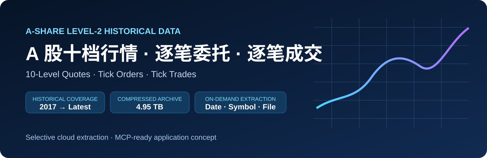
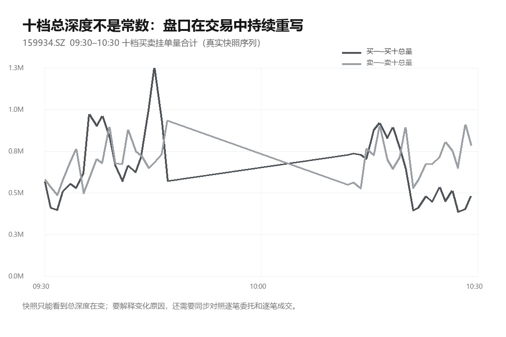

  <b>简体中文</b> · <a href="./README_EN.md">English</a>

  

<h1 align="center">10档逐笔 Tick L2 · A股逐笔十档行情 · 逐笔委托 · 逐笔成交</h1>

沪深 Level-2 原始行情 · 十档盘口快照 + 逐笔成交 + 逐笔委托 · 按交易日 7z 打包

  
  
  
  
  

  <a href="#产品一览">产品一览</a> ·
  <a href="#真实样本">真实样本</a> ·
  <a href="#数据覆盖">数据覆盖</a> ·
  <a href="#按需提取工具">按需提取工具</a> ·
  <a href="#ai--mcp-应用方案">AI / MCP</a> ·
  <a href="#联系与获取">联系与获取</a>

---

## 产品一览

这套历史数据不是单一的分钟线或普通五档快照，而是把 **十档行情快照、逐笔委托事件、逐笔成交事件** 分开保留。做盘口研究时可以看某一时点的深度，做订单流研究时又能继续下钻到委托与成交事件。

| 数据文件 | 核心内容 | 时间/频率 | 典型用途 |
|---|---|---|---|
| **行情.csv** | 买一～买十、卖一～卖十及挂单量，成交价量额、开高低前收等 | 连续竞价约 **3 秒一笔** | 十档盘口、订单簿深度、盘中复盘、特征工程 |
| **逐笔委托.csv** | 委托时间、委托号、买卖代码、委托价格、委托数量等 | 一笔一条，时间实际精度 **10 ms** | 委托流、挂单行为、委托簿重建 |
| **逐笔成交.csv** | 成交时间、成交号、成交价格、成交数量、买卖相关序号等 | 一笔一条，时间实际精度 **10 ms** | 成交流、逐笔复盘、委托/成交关联 |

> 公开仓库只展示字段说明与少量真实截取样本，不公开全量商品数据，也不披露数据生产、清洗、算法和内部脚本实现。

---

## 真实样本

### 产品典型实测：600519.SH · 2026-06-12

| 表 | 实测记录数 | 列数 |
|---|---:|---:|
| 十档行情快照 | **4,998** | **66** |
| 逐笔成交 | **39,738** | **12** |
| 逐笔委托 | **85,278** | **10** |

十档连续竞价快照约 3 秒一笔；逐笔委托与逐笔成交为事件流，时间字段写到毫秒位、实际精度 10 毫秒。所有价格字段均为整数、单位万分之一元。

完整字段字典、600519 开盘后 3 笔原样摘录及集合竞价说明见 [docs/FIELDS.md](./docs/FIELDS.md) 和 [docs/SAMPLES.md](./docs/SAMPLES.md)。

本仓库样本来自本地商品目录中的真实文件：**159934.SZ · 2026-07-10**。

整日原始文件经实际读取统计：

| 文件 | 真实行数 | 原文件大小 | 主要字段数 |
|---|---:|---:|---:|
| 行情.csv | **4,835** | 约 1.75 MB | **66** |
| 逐笔委托.csv | **53,996** | 约 3.27 MB | **10** |
| 逐笔成交.csv | **64,132** | 约 4.35 MB | **12** |

公开样本仅保留极少量记录并转为 UTF-8，方便直接在 GitHub 预览：

- [行情.sample.csv](./samples/159934.SZ/行情.sample.csv)
- [逐笔委托.sample.csv](./samples/159934.SZ/逐笔委托.sample.csv)
- [逐笔成交.sample.csv](./samples/159934.SZ/逐笔成交.sample.csv)
- [字段说明](./docs/FIELDS.md)
- [真实样本说明](./docs/SAMPLES.md)
- [数据口径与 FAQ](./docs/DATA_NOTES.md)

### 十档盘口不是一张“截图”

  

一个时点能看到买卖十档深度；真正做复盘时，盘口会持续重写，所以通常还要结合逐笔委托和逐笔成交一起看。

### 委托流与成交流是两条不同的事件流

  

### 盘口深度随交易持续变化

  

---

## 数据覆盖

| 项目 | 当前产品口径 |
|---|---|
| 年份 | **2017 ～ 至今** |
| 市场 | **沪深两市 Level-2 原始行情** |
| 当日覆盖实测 | **2026-06-12：7,744 只标的** |
| 交付表 | **3 张：行情 / 逐笔成交 / 逐笔委托** |
| 组织方式 | **一个交易日一个 7z 包，包内按股票分目录，每只 3 个 CSV** |
| 原始编码 | **GB18030** |
| 2025 全年压缩态 | 约 **869 GB** |
| 2017 至今压缩态 | 约 **4.95 TB / 2,361 个交易日** |

> 深市 2017 年起三张表均有；沪市逐笔委托从 **2021-07-26** 起提供，此前沪市只有十档快照和逐笔成交。详细口径见 [数据说明与 FAQ](./docs/DATA_NOTES.md)。

---

## 关键数据口径

> 这些细节非常重要，尤其是准备做高频回放或重建委托簿时。

| 口径 | 说明 |
|---|---|
| 价格单位 | **整数 / 10000 = 元**，例如 12790000 = 1279.00 元 |
| 逐笔时间 | `HHMMSSmmm`，实际精度 **10 ms**，末位为 0 |
| 十档快照 | 连续竞价约 **3 秒一笔**；不是逐事件更新 |
| 集合竞价 | **09:15 开始记录**，开盘和收盘竞价都包含 |
| 沪市撤单 | 逐笔委托表，`委托类型 = D` |
| 深市撤单 | 逐笔成交表，`成交代码 = C` |
| CSV 编码 | **GB18030**，表头末尾还有一个空字段 |
| 特殊字段 | IOPV 主要用于基金；指数统计字段普通股票通常为 0 |

详细说明：[docs/DATA_NOTES.md](./docs/DATA_NOTES.md)。

---

## 按需提取工具

历史高频数据最大的使用成本之一就是体量。配套 **网盘压缩包提取器 v1.1.0** 可以直接针对百度网盘在线压缩包按需提取，而不是先把整包下载到本地。

### 可以按什么条件取？

- 日期
- 股票代码
- 文件名（行情.csv / 逐笔委托.csv / 逐笔成交.csv）
- 多条规则批量执行
- Excel 模板批量导入

一个实际目录结构示例：

~~~text
/逐笔十档tick数据(17-23)/
└─ 2017/
   └─ 201706/
      └─ 20170619.7z
         └─ 20170619/
            ├─ 000001.SZ/
            │  ├─ 行情.csv
            │  ├─ 逐笔委托.csv
            │  └─ 逐笔成交.csv
            └─ ...
~~~

> 17-23 是历史目录名称，不代表数据只到 2023；最新范围以网盘实际目录为准。

### 典型提取规则

~~~text
日期：20170619
股票匹配：精确
股票代码：000001
文件匹配：精确
文件名：行情.csv
~~~

~~~mermaid
flowchart LR
    A[选择日期 / 股票 / 文件] --> B[校验计划]
    B --> C[开始执行]
    C --> D[百度网盘在线压缩包]
    D --> E[只提取目标 CSV]
~~~

完整公开使用说明见 [docs/TOOL_GUIDE.md](./docs/TOOL_GUIDE.md)。

---

## AI + MCP 应用方案

现有的“按日期 + 股票 + 文件类型提取”能力天然适合进一步封装为 **MCP 工具**，让 AI 直接调用历史数据提取能力。

例如用户可以直接说：

~~~text
我要 2024-05-20 的 000001 十档行情。
~~~

~~~text
帮我提取 2023-12-08 的 600519 逐笔成交。
~~~

~~~text
给我 2024-06-18 的 300750 逐笔委托。
~~~

理想流程：

~~~mermaid
flowchart LR
    U[自然语言需求] --> AI[AI 解析]
    AI --> P[日期 / 证券 / 数据类型]
    P --> MCP[MCP 提取工具]
    MCP --> ZIP[网盘在线压缩包]
    ZIP --> CSV[目标 CSV]
    CSV --> A[继续分析 / 回测 / 复盘]
~~~

**重要说明：本仓库展示的是 MCP 可扩展应用方案，并没有把 MCP 服务伪装成已经交付的现成功能。** 当前公开内容仍以历史数据产品与配套按需提取工具为主。

更多说明见 [docs/MCP_USE_CASES.md](./docs/MCP_USE_CASES.md)。

---

## 适用场景

- A 股盘口 / 订单流 / 市场微观结构研究
- 十档盘口和高频特征构建
- 逐笔委托 / 逐笔成交历史复盘
- 量化研究、回测、机器学习样本整理
- 某个交易日、某只证券的盘中细节追溯
- AI 数据工作流：按自然语言意图提取，再继续分析

---

## 联系与获取

**QQ：2565473796**  
添加时请注明来意，例如：**十档行情 / GitHub / 数据咨询**。

**公众号：代码炒家阿凯**

<table>
  <tr>
    <td align="center" width="50%">
       
      <b>QQ：2565473796</b> 
      添加时请注明来意
    </td>
    <td align="center" width="50%">
       
      <b>公众号：代码炒家阿凯</b> 
      欢迎关注
    </td>
  </tr>
</table>

---

## 仓库边界

本仓库用于产品介绍、字段展示、少量样本预览和工具使用说明。不会公开全量历史数据、数据生产/采集/清洗核心逻辑、算法、内部脚本、账号、激活信息、凭据或其他敏感配置。

本产品主要用于数据研究、程序开发、量化学习与历史复盘，不构成任何投资建议，也不承诺任何收益。
218