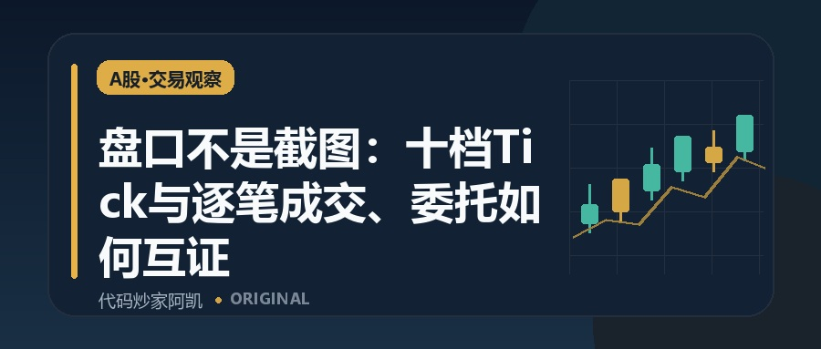
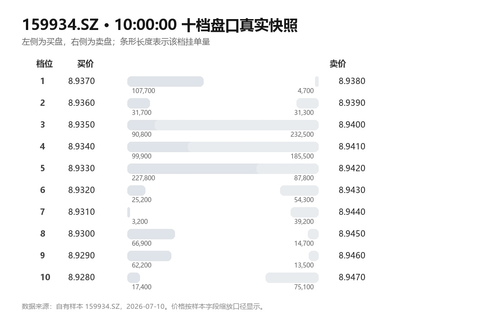
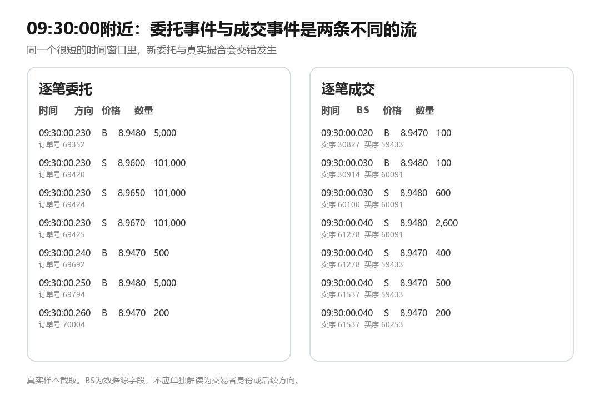

  <a href="./README.md">简体中文</a> · <b>English</b>

  

<h1 align="center">A-Share 10-Level Quotes · Order-by-Order Entrusts · Trade-by-Trade Executions</h1>

Historical Level-2 data showcase · selective archive extraction · AI / MCP extension concept

  
  
  
  
  

## Overview

The product separates three historical data streams instead of flattening everything into bars:

| File | What it contains | Typical use |
|---|---|---|
| 行情.csv | 10 bid levels + 10 ask levels and sizes, trade/turnover statistics and daily price fields | order-book depth, intraday replay, feature engineering |
| 逐笔委托.csv | event time, order identifiers, side code, price and quantity | order-flow and order-event research |
| 逐笔成交.csv | execution time, trade ID, price, quantity and buy/sell related sequence fields | trade-flow and execution analysis |

The repository publishes only documentation and tiny excerpts of real samples. It does **not** publish the full commercial archive or internal production logic.

## Verified sample

The local source material includes a real sample for **159934.SZ on 2026-07-10**:

| File | Full-day rows | Source file size | Main fields |
|---|---:|---:|---:|
| Market snapshots | 4,835 | ~1.75 MB | 66 |
| Order-by-order entrusts | 53,996 | ~3.27 MB | 10 |
| Trade-by-trade executions | 64,132 | ~4.35 MB | 12 |

See [docs/FIELDS.md](./docs/FIELDS.md) and [samples/159934.SZ](./samples/159934.SZ/).

## Coverage stated in the current product material

| Asset class | Stated coverage |
|---|---|
| Shanghai / Shenzhen A-shares | 2017 to present |
| ETF / LOF | Sep 2023 to present |
| Convertible bonds | Jan 2023 to present |
| Other | selected B-shares, government bonds, etc. |
| Securities in the archive | 30,000+ |
| Historical archive | about 5 TB |

The current product material also states that the archive is continuously updated. Actual delivery scope and latest trading date should be confirmed from the current product listing and netdisk directory at purchase time.

## Selective extraction tool

The bundled netdisk archive extractor (v1.1.0) retrieves only required files from Baidu Netdisk online archives by trading date, security code and target filename. It also supports multiple rules and Excel batch templates.

See [docs/TOOL_GUIDE.md](./docs/TOOL_GUIDE.md).

## AI / MCP extension concept

The existing structured extraction workflow can be **wrapped as an MCP tool** in a future AI workflow. A user could simply ask:

~~~text
Get the 10-level market data for 000001 on 2024-05-20.
~~~

~~~text
Extract the trade-by-trade execution file for 600519 on 2023-12-08.
~~~

An AI agent could parse date, security and data type, call the extractor, return the target CSV and continue with downstream research.

**This repository describes MCP as an extension concept. It does not claim that a production MCP server is already shipped here.**

See [docs/MCP_VISION.md](./docs/MCP_VISION.md).

## Contact

**QQ: 2565473796**  
Please mention your purpose when adding the contact, e.g. **Level-2 data / GitHub / data inquiry**.

**Official account: 代码炒家阿凯**

The authorized local workspace did not contain source-verifiable QQ / official-account QR images, so no QR code is fabricated in this repository.

## Disclaimer

This repository is a product showcase and documentation repository. It does not disclose the full archive, internal acquisition/cleaning logic, algorithms, scripts, credentials, activation details or other sensitive implementation information. The data is intended for research, development, learning and historical replay; nothing here is investment advice.
97